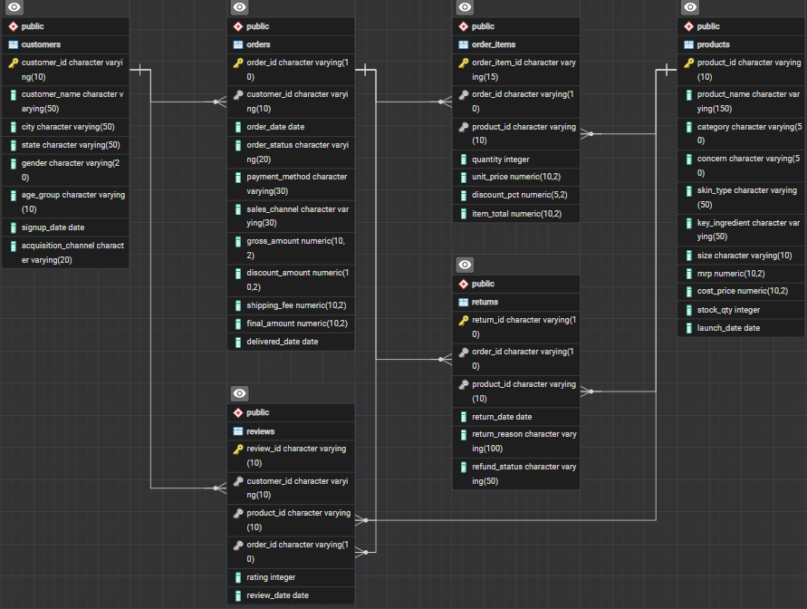
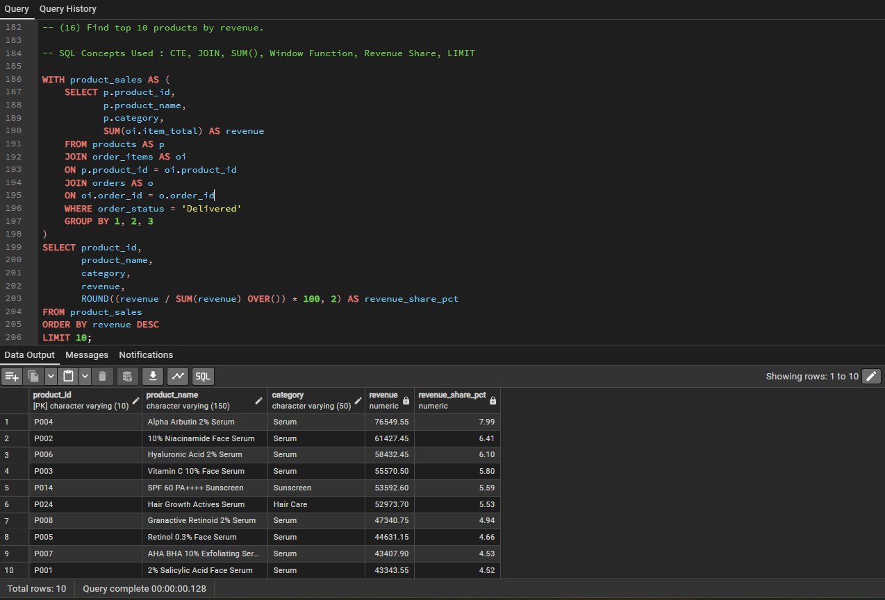
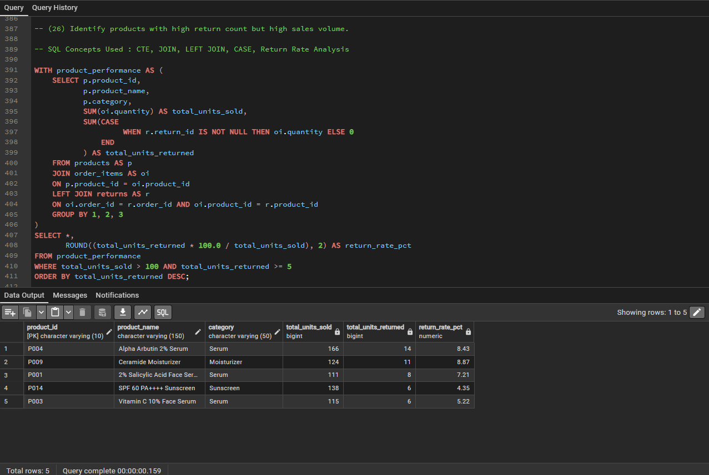
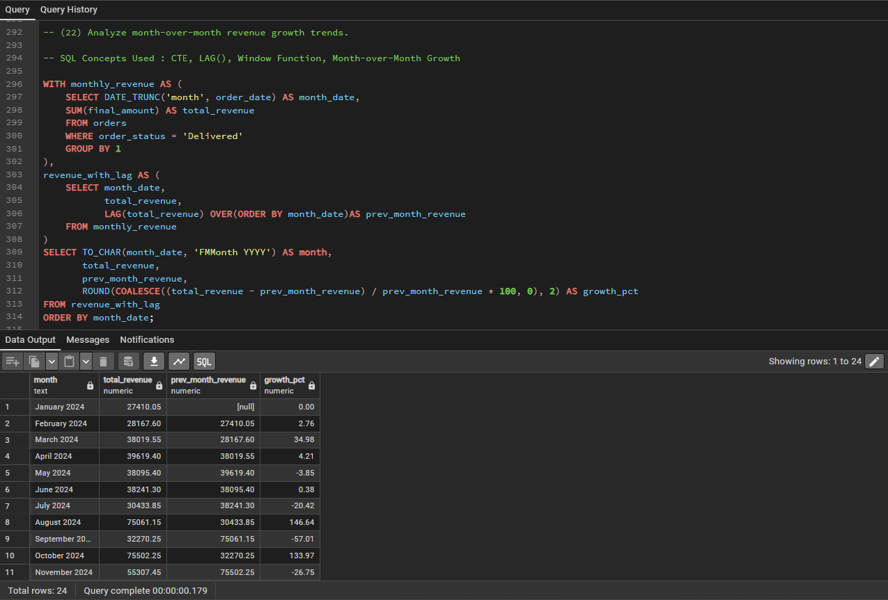
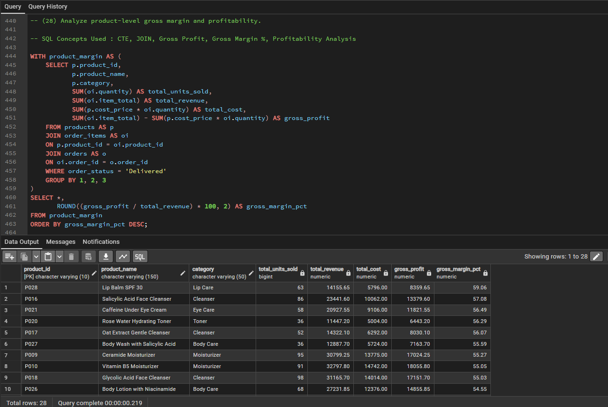
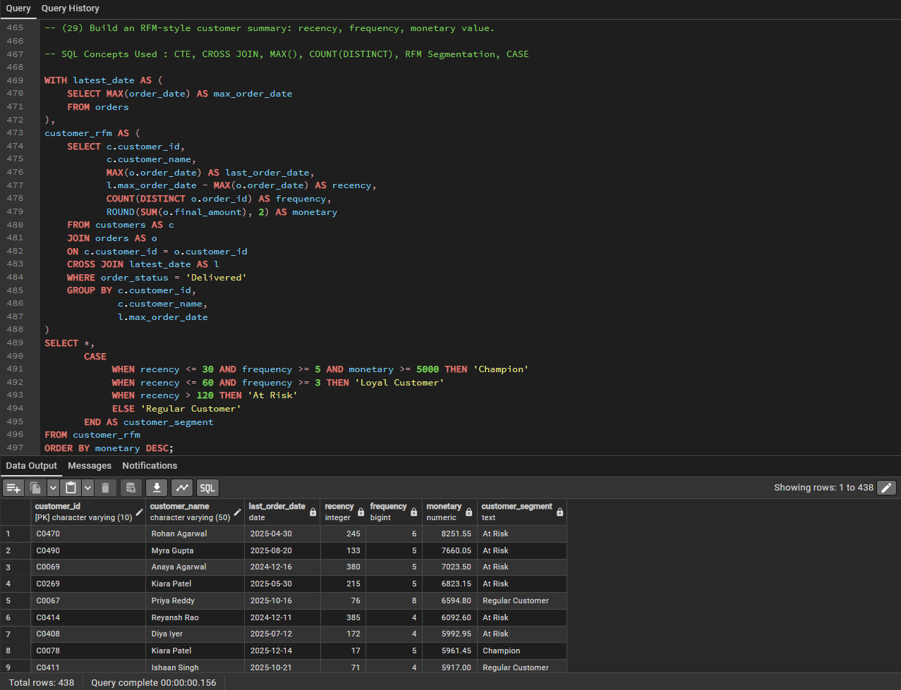
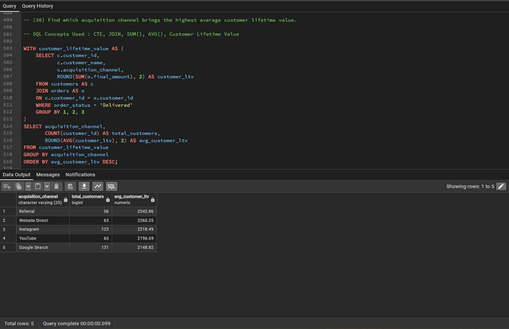

<div align="center">

# Minimalist Skincare SQL Analytics

### PostgreSQL portfolio project for e-commerce sales, customer, product, return, and marketing analysis

[](https://www.postgresql.org/)
[](SQL/Business_Queries.sql)
[](https://www.pgadmin.org/)
[](#skills-demonstrated)
[](https://www.kaggle.com/datasets/kaushalvyas16/d2c-skincare-e-commerce-analytics-dataset)\n[](LICENSE)

</div>

---

## Table of Contents

- [Project Overview](#project-overview)
- [Business Problem](#business-problem)
- [Project Highlights](#project-highlights)
- [Tools and Technologies](#tools-and-technologies)
- [Dataset and Data Model](#dataset-and-data-model)
- [SQL Analysis](#sql-analysis)
- [Key Business Insights](#key-business-insights)
- [Project Structure](#project-structure)
- [How to Run the Project](#how-to-run-the-project)
- [Analysis Preview](#analysis-preview)
- [Business Recommendations](#business-recommendations)
- [Skills Demonstrated](#skills-demonstrated)
- [Dataset Source](#dataset-source)
- [Disclaimer](#disclaimer)
- [Author](#author)

---

## Project Overview

This project is a business-focused SQL analytics case study developed in **PostgreSQL** for a synthetic direct-to-consumer skincare brand inspired by Minimalist India.

It transforms six related e-commerce datasets into actionable insights about revenue, customer behavior, product performance, profitability, returns, inventory, and acquisition-channel effectiveness. The analysis progresses from basic filtering and aggregation to advanced window functions, customer segmentation, month-over-month growth, and RFM analysis.

> **Business goal:** turn transactional skincare data into clear recommendations for marketing, retention, product, and inventory decisions.

---

## Business Problem

The business needs to understand:

- Which products and categories generate the most revenue?
- Which products combine high sales volume with high return counts?
- Which acquisition channels attract the most valuable customers?
- Which customers are inactive, at risk, or high value?
- Which products deliver the strongest gross margins?
- How does revenue change month over month?
- Which products perform best across different skin types?

The resulting insights can support marketing allocation, customer retention, inventory planning, product improvement, and profitability management.

---

## Project Highlights

- **6 relational tables** covering customers, products, orders, order items, reviews, and returns
- **30 business questions** organized across basic, intermediate, and advanced SQL
- Revenue, profitability, returns, customer lifetime value, and product-preference analysis
- Advanced SQL using CTEs, window functions, ranking, running totals, and (RFM) metrics
- Reproducible PostgreSQL workflow with table creation, CSV import, and analysis scripts
- Portfolio-ready visual evidence for key findings

---

## Tools and Technologies

| Tool | Purpose |
|---|---|
| PostgreSQL | Relational database and analytical query engine |
| SQL | Data exploration, aggregation, segmentation, and business analysis |
| pgAdmin 4 | Database administration and query execution |
| CSV | Source datasets |
| GitHub | Version control and project documentation |

---

## Dataset and Data Model

The project uses six interconnected tables that simulate a skincare e-commerce database.

| Table | Description |
|---|---|
| `customers` | Customer profiles, locations, skin types, and acquisition details |
| `products` | Product catalogue, categories, prices, costs, and stock |
| `orders` | Order-level transactions, channels, payments, and status |
| `order_items` | Product-level quantities and selling prices within each order |
| `reviews` | Product ratings and customer reviews |
| `returns` | Returned items, reasons, and return details |

### Core Relationships

- `customers` → `orders`
- `orders` → `order_items`
- `products` → `order_items`
- `products` → `reviews`
- `order_items` → `returns`

### Database Schema

<p align="center">
  
</p>

---

## SQL Analysis

The complete set of queries is available in [`SQL/Business_Queries.sql`](SQL/Business_Queries.sql).

### Basic Analysis

1. Retrieve all serum products.
2. Find products with stock below 150 units.
3. List customers from Gujarat.
4. Show orders placed in October 2025.
5. Calculate revenue from delivered orders.
6. Find the most expensive product by MRP.
7. Identify orders with a final amount above ₹1,500.
8. List all available product categories.
9. Classify the five lowest-stock products by inventory status.
10. Count customers by acquisition channel.

### Intermediate Analysis

11. Calculate the monthly revenue trend.
12. Find the top five cities by delivered revenue.
13. Calculate quantity sold by product category.
14. Identify repeat customers with more than two delivered orders.
15. Calculate average order value by sales channel.
16. Find the top ten products by revenue.
17. Calculate return rate by product category.
18. Find products with an average rating above 4.2.
19. Measure revenue contribution by payment method.
20. Compare each customer's acquisition month with their first-order month.

### Advanced Analysis

21. Rank the top three revenue-generating products within each category.
22. Analyze month-over-month revenue growth.
23. Segment customers into high-, medium-, and low-value groups.
24. Identify customers inactive for 90 days relative to the latest dataset order.
25. Calculate cumulative monthly revenue.
26. Detect products with both high sales volume and high return counts.
27. Find the best-selling product for each skin type.
28. Analyze product-level gross margin and profitability.
29. Build an RFM customer summary using recency, frequency, and monetary value.
30. Determine which acquisition channel produces the highest average customer lifetime value.

### SQL Concepts Demonstrated

`JOIN` · `LEFT JOIN` · `GROUP BY` · `HAVING` · `CASE` · Subqueries · CTEs · Window Functions · `RANK()` · `LAG()` · Running Totals · RFM Analysis

---

## Key Business Insights

- **Serums lead revenue performance:** Alpha Arbutin 2% Serum generates the highest product-level revenue.
- **Demand appears seasonal:** strong revenue spikes occur in August 2024, October 2024, and October 2025, potentially reflecting promotional or festive periods.
- **Growth is volatile:** month-over-month performance includes both sharp increases and declines, indicating uneven purchasing cycles.
- **Returns require attention:** Body Care and Serum show the highest category-level return rates.
- **Lip Balm SPF 30 is highly profitable:** its gross margin is approximately 59%, placing it among the strongest products by margin.
- **Referrals attract valuable customers:** the referral channel generates the highest average customer lifetime value.
- **Retention opportunities exist:** RFM analysis identifies historically valuable customers who are now at risk.
- **High-volume products need investigation:** Alpha Arbutin 2% Serum and Ceramide Moisturizer combine strong sales with elevated return counts.
- **Preferences vary by skin type:** product affinity differs across customer skin types, supporting targeted recommendations and campaigns.

---

## Project Structure

```text
minimalist-skincare-sql-analytics/
├── Data/
│   ├── Customers.csv
│   ├── Order_Items.csv
│   ├── Orders.csv
│   ├── Products.csv
│   ├── Returns.csv
│   └── Reviews.csv
├── Images/
│   ├── Database_Schema.png
│   ├── acquisition_channel_distribution.png
│   ├── channel_clv_analysis.png
│   ├── gross_margin_analysis.png
│   ├── high_sales_high_returns.png
│   ├── mom_revenue_growth.png
│   ├── rfm_customer_segmentation.png
│   └── top_revenue_products.png
├── SQL/
│   ├── Business_Queries.sql
│   ├── Create_Tables.sql
│   └── Import_Data.sql
├── LICENSE\n└── README.md
```

### Quick Links

- [View datasets](Data/)
- [Create database tables](SQL/Create_Tables.sql)
- [Import CSV data](SQL/Import_Data.sql)
- [Explore all business queries](SQL/Business_Queries.sql)
- [Browse analysis images](Images/)

---

## How to Run the Project

### Prerequisites

Install:

- [PostgreSQL](https://www.postgresql.org/download/)
- [pgAdmin 4](https://www.pgadmin.org/download/) or another PostgreSQL client
- Git, if you want to clone the repository locally

### Setup

1. Clone the repository:

   ```bash
   git clone https://github.com/Chanchadiyakaushal201/minimalist-skincare-sql-analytics.git
   cd minimalist-skincare-sql-analytics
   ```

2. Create a PostgreSQL database for the project.

3. Open and run [`SQL/Create_Tables.sql`](SQL/Create_Tables.sql).

4. Review the CSV file paths in [`SQL/Import_Data.sql`](SQL/Import_Data.sql) and update them for your local environment.

5. Run [`SQL/Import_Data.sql`](SQL/Import_Data.sql) to load the six datasets.

6. Execute [`SQL/Business_Queries.sql`](SQL/Business_Queries.sql) to reproduce the analysis.

> **Note:** PostgreSQL `COPY` paths depend on your operating system and server configuration. Use absolute local paths and ensure the PostgreSQL service can read the dataset directory.

---

## Analysis Preview

### Top Revenue-Generating Products

<p align="center">
  
</p>

### High-Sales, High-Return Products

<p align="center">
  
</p>

### Month-over-Month Revenue Growth

<p align="center">
  
</p>

### Gross Margin Analysis

<p align="center">
  
</p>

### RFM Customer Segmentation

<p align="center">
  
</p>

### Acquisition Channel Customer Lifetime Value

<p align="center">
  
</p>

---

## Business Recommendations

1. Investigate the causes of elevated returns for high-volume Serum and Body Care products.
2. Prioritize high-margin products such as Lip Balm SPF 30 in promotions and bundles.
3. Increase investment in referral programs because they attract higher-value customers.
4. Launch re-engagement campaigns for high-value customers classified as at risk.
5. Align inventory and promotional planning with observed seasonal revenue spikes.
6. Use skin-type preferences to support more personalized product recommendations.

---

## Skills Demonstrated

- Relational database design
- PostgreSQL table creation and CSV ingestion
- Data validation and exploratory SQL
- Multi-table joins and aggregation
- CTEs and nested queries
- Window functions and ranking
- Time-series and growth analysis
- Product profitability and return analysis
- Customer segmentation and RFM analysis
- Business insight generation
- Technical documentation and data storytelling

---

## Dataset Source

The synthetic D2C skincare dataset is available on Kaggle:

[**D2C Skincare E-commerce Analytics Dataset**](https://www.kaggle.com/datasets/kaushalvyas16/d2c-skincare-e-commerce-analytics-dataset)

---

## License

This project is licensed under the [MIT License](LICENSE).

---

## Disclaimer

This project uses synthetic data created for learning and portfolio purposes. It is inspired by a D2C skincare e-commerce business model and is **not affiliated with, endorsed by, or based on official data from Minimalist**.

---

## Author

### Kaushal Chanchadiya

Aspiring Data Analyst focused on converting raw data into clear business insights through SQL, analytics, visualization, and data storytelling.

[](https://www.linkedin.com/in/kaushalchanchadiya162004/)
[](https://github.com/Chanchadiyakaushal201)

---

<div align="center">

If this project helped you, consider giving the repository a ⭐.

[Back to top](#minimalist-skincare-sql-analytics)

</div>
